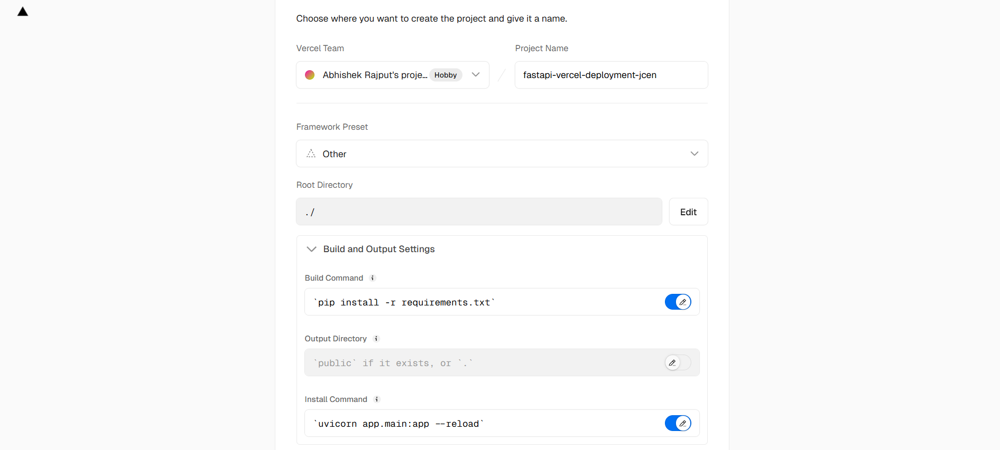

# FastAPI Deployment on Vercel

## 🚀 Overview
This repository contains a **FastAPI** application deployed on **Vercel**. The app includes basic API routes and follows best practices for seamless deployment using Vercel's serverless functions.

## 🌍 Live Deployment
FastAPI app is live at:
```
https://fastapi-vercel-deployment-vert.vercel.app/
```

## 🛠️ Steps to Deploy on Vercel

### 1️⃣ **Push Your Code to GitHub**
Ensure your FastAPI application is pushed to a GitHub repository.

### 2️⃣ **Deploy on Vercel**
- Go to [Vercel](https://vercel.com/) and create a new project.
- Select `Other Framework`.
- Set the **Build Command** as:
  ```sh
  pip install -r requirements.txt
  ```
- Set the **Install Command** as:
  ```sh
  uvicorn app.main:app --reload
  ```
- Modify `vercel.json` as per your project structure (example below).

### 3️⃣ **Modify `vercel.json`**
Ensure your `vercel.json` is properly configured:
```json
{
  "builds": [
    {
      "src": "app/main.py",
      "use": "@vercel/python"
    }
  ],
  "routes": [
    {
      "src": "/(.*)",
      "dest": "app.main:app"
    }
  ]
}
```
### Screenshot



## 🔥 Testing the API
Once deployed, test the API:
- **Root Endpoint:**
  ```
  https://your-vercel-app.vercel.app/
  ```
  **Response:** `{ "message": "Hello World from Abhishek" }`

- **Test Endpoint:**
  ```
  https://your-vercel-app.vercel.app/test
  ```
  **Response:** `{ "message": "this is test1" }`

## 🤝 Contributing
Feel free to fork this repo, submit issues, and make pull requests!

## 📜 License
This project is licensed under the **MIT License**.

## Author
Abhishek Rajput

---

